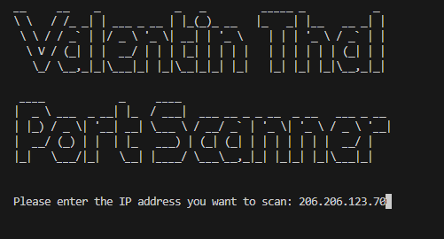
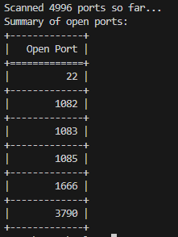

# Port Scanner

This is a simple port scanner developed by Valentin Thal. It scans for open ports on a user-specified IP address. The project is written in Python and utilizes the `socket` library to attempt connections on a range of ports. Multithreading is used to improve the scanning speed.

## Features

- Asks the user to input an IP address to scan.
- Scans ports in the range from 1 to 5000.
- Displays real-time progress updates.
- Displays open ports as they are found.
- Provides a summary of all open ports in a tabular format at the end of the scan.
- Utilizes multithreading for faster scanning.

## Installation

1. Clone the repository:

    ```bash
    git clone https://github.com/valpas3457/port-scanner.git
    ```

2. Navigate to the project directory:

    ```bash
    cd port-scanner
    ```

3. Install the required dependencies:

    ```bash
    pip install pyfiglet tabulate
    ```

## Usage


Run the script:

```bash
python port_scanner.py
  ```
## Exemple


